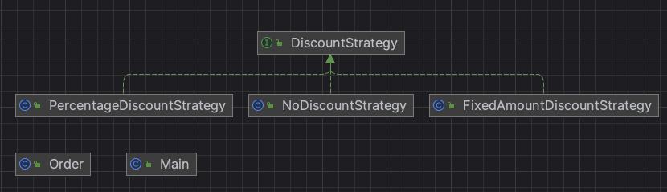

# 전략 패턴

## 정의

> 알고리즘 클래스 컬렉션을 정의하고, 각 알고리즘을 개별적으로 캡슐화하여, 이를 서로 교환 가능하게 만드는 것이며, 전략 패턴은 이를 사용하는 클라이언트와는 독립적으로 알고리즘을 변경할 수 있다. - GoF의 디자인 패턴

- Strategy Pattern
- 알고리즘군을 정의하고 캡슐화해서 각각의 알고리즘군을 수정해서 쓸 수 있게 해줌
- 전략 패턴을 사용하면 클라이언트로부터 알고리즘을 분리해서 독립적으로 변경할 수 있음
- 전략 패턴은 위임을 활용함
    - 위임은 메소드의 실제 구현을 다른 클래스에 위임(기능의 캡슐화)하는 것
    - 프로그램의 변경되는 부분을 찾아내서, 바뀌지 않는 부분으로부터 분리 시키는 디자인 원칙

## 사용 이유
- 매우 복잡한 형태의 if-else 분기와 switch-case 분기를 피하기 위해 사용
- 프레임워크를 확장하는데 사용
- 정책이나 알고리즘 교체를 해야 하는 경우에 사용
- 라이언트와 독립적인 다양한 알고리즘을 적용하기 위해 사용

## 장점
- Context 클래스가 다른 클래스에 의존하는 정도가 최대한 낮아짐
    - 오직 Strategy 클래스에만 의존
- 알고리즘 관련하여 Context 내부 클래스를 수정하지 않아도 됨
- Strategy 하위 클래스를 통해 알고리즘을 자유롭게 변경, 확장, 수정할 수 있음
- 인터페이스에 선언된 기능을 구현한 다양한 정책을 다른 클래스에 영향을 주지 않고 추가, 삭제할 수 있음
- 각 기능에서 if - else 조건문을 구현하는 것이 아닌 정책 클래스를 선택하도록 구현하여 유지보수가 용이

## 예시
- Order: 총 주문 금액과 할인 전략 담은 주문 클래스
- discount: 할인 전략 패키지
  - DiscountStrategy: 할인 전략 인터페이스
    - NoDiscountStrategy: 정가로 구매하는 할인 없는 전략 구현 클래스
    - FixedAmountDiscountStrategy: 고정 금액 할인 전략 구현 클래스
    - PercentDiscountStrategy: 퍼센트 할인 전략 구현 클래스
- Main: 주문 생성 하는 메인 클래스

### diagram

