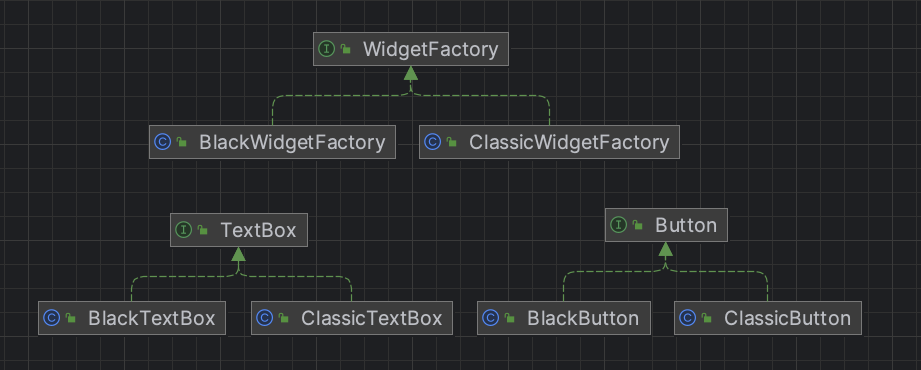

# 추상 팩토리 패턴
- 여러 제품군을 한꺼번에 생성하는 패턴
  - 공장을 선택하면 상품 세트 한번에 나오는 형태
- 팩토리 메서드를 확장한 패턴
  - 팩토리 메서드보다 좀 더 큰 그룹 단위 객체를 생성 관리
- 추상 팩토리는 여러 개의 팩토리 메서드를 그룹으로 묶은 것과 유사한 패턴

## 목적과 특징
- 추상화된 인터페이스 팩토리를 제공하고 상황에 따라 그에 맞는 인스턴스들이 생성되도록 함
- 생성 패턴을 그룹 형태로 변경, 추상화를 통해 그룹을 만듦
- 추상 팩토리는 추상화의 다형성을 이용하여 객체 생성 그룹을 형성하고 추상화와 다형성을 이용하여 집단 단위의 객체 생성을 관리할 수 있음
  - 즉, 추상화와 상속을 극대화해 다형성의 특징을 응용
- 공장의 개념을 추상화
  - 하나의 군으로 묶인 그룹들을 공장으로 취급
  - 단위 객체들을 생성하는 공장 시스템과 같음
- 복수의 하위 클래스를 가짐

## 패턴 사용 케이스
- 추상 팩토리는 다양한 객체 생성 과정에서 그룹화가 필요할 때
- 하나 이상의 제품군들 중 하나를 선택하여 시스템을 설정해야 하고 구성한 제품을 다른 것으로 대체할 수 있을 때
  - 예) 위젯 생성 시 선택한 옵션에 따라 위젯의 세트 달라지도록 함

## 유사한 패턴과 차이점
- 팩토리 패턴, 팩토리 메서드 패턴, 추상 팩토리 패턴은 매우 유사한 생성 패턴
- 팩토리 패턴과 팩토리 메서드 패턴 차이는 추상화
- 팩토리 메서드 패턴과 추상 팩토리 메서드 패턴의 차이는 추상화된 그룹을 형성하고 관리하는 것
  - 팩토리 메서드는 추상 팩토리와 동일하게 추상화 과정을 적용할 수 있지만 단일 그룹으로 제한

|  | 추상 팩토리 패턴| 팩토리 메서드 패턴                                | 팩토리 패턴                             |
| --- |----|-------------------------------------------|------------------------------------|
| 목적 | 추상화된 객체의 그룹 생성     | 객체 생성을 서브 클래스에게 위임하여 객체 생성을 지연하거나 변경 쉽게 함 | 객체 생성을 단순화하고 클라이언트 코드와 객체 생성 코드를 분리 |
| 예시 | GUI 라이브러리에서 플랫폼에 따른 버튼, 텍스트 상자, 체크박스 등의 GUI 요소 생성 | 결제 모둘 생성하는 팩토리 메서드| 게임 캐릭터 생성하는 팩토리|
| 장점 | 객체 집합을 생성하기 위한 일관된 인터페이스 제공, 관련된 객체 집합을 쉽게 변경할 수 있음 | 객체 생성을 서브 클래스에 위임하여 유연한 객체 생성 가능          | 객체 생성과 클라이언트 코드의 분리로 유지보수성 향상      |
| 단점 | 객체 집합이 확장되거나 변경될 때 추상 팩토리와 모든 구체적인 팩토리를 수정해야 함 | 새로운 종류의 객체를 추가할 때마다 서브 클래스를 만들어야 함        | 새로운 객체를 추가할 때마다 팩토리 클래스를 수정해야 함    |

## 장점
- 생성 패턴을 독립적으로 동작하도록 분리하며 분리된 하나의 그룹별로 객체를 선택하여 생성할 수 있음
- 큰 변화 없이 시스템 군을 생성하고 변경할 수 있음
- 인터페이스와 같은 역할을 하기도 해서 코드를 일관적으로 유지하고 실제 구현을 다르게 실행 시킬 수 있음

## 단점
- 기존 그룹에서 새로운 그룹을 추가하여 확장 시 모든 서브 클래스들이 동시에 변경 되어야 함
- 새로운 종류 추가 시 구조를 재설계 해야 해서 확장성 부분에서 좋지 않음
- 관리할 그룹이 많음
- 계층의 크기가 커질 수록 복잡한 문제가 발생

## 예시
- 위젯 생성 시 스타일에 따라 버튼과 텍스트박스 생성하는 예시
- widget
  - factory
    - WidgetFactory: 위젯 생성 팩토리 인터페이스
    - BlackWidgetFactory: 블랙 스타일 위젯 생성 팩토리
    - ClassicWidgetFactory: 클래식 스타일 위젯 생성 팩토리
  - button
    - Button: 버튼 기능 인터페이스
    - BlackButton: 블랙 스타일 버튼 기능 구현체
    - ClassicButton: 클래식 스타일 버튼 기능 구현체
  - textbox:
    - TextBox: 텍스트 박스 기능 인터페이스
    - BlackTextBox: 블랙 스타일 텍스트 박스 기능 구현체
    - ClassicTextBox: 클래스 스타일 텍스트 박스 기능 구현체
- WidgetMain: 위젯 생성 클라이언트 코드

### diagram

