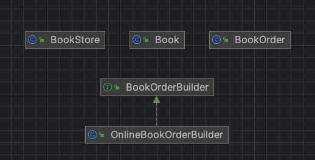

# 빌더 패턴
- 메서드의 조합으로 결과물을 생성하는 방법
  - 단계별 생성에 중점을 두는 패턴
- 생성에 대한 과정과 각 결과물을 표현하는 방법을 분리하여 동일한 생성 과정에 서로 다른 여러 결과물이 나올 수 있도록 함

## 목적 및 특징
- 객체 생성 단순화
  - 빌더 패턴은 복잡한 구조를 가진 복합 객체의 생성 과정을 분리하여 처리하는 패턴
- 가독성 향상
  - 생성 과정과 구현 방법을 분리하여 동일한 생성에서 여러 다른 표현이 나올 수 있음
- 클라이언트 코드는 builder가 제공하는 메서드를 기반으로 원하는 결과물을 얻을 수 있음
- 빌더 패턴은 추상 팩토리를 확장하여 크고 복잡한 객체를 생성할 수 있음
  - 팩토리, 팩토리 메서드, 추상 메서드 패턴은 내부적으로 다른 클래스의 객체를 포함하는 복합 객체를 생성할 수는 없음 → 빌더 패턴은 복잡한 구조의 복합 객체를 생성하는 로직을 별도로 분리하여 객체 생성을 처리

## 장점
- 빌더를 사용시 아래와 같은 점층적 생성자를 사용하지 않을 수 있음
- 잘못된 데이터를 넣는 오류를 방지하고 유연하게 사용이 가능

```java
class Pizza {
  Pizza(int size) { ... }
  Pizza(int size, boolean cheese) { ... }
  Pizza(int size, boolean cheese, boolean pepperoni) { ... }
  // …
```

- 생성과정과 구현을 분리함
- 제품의 다양한 구현이 가능
- 제품의 생산 과정을 더 세분화 할 수 있음
- 클라이언트는 구체적인 사항을 알 필요가 없음
- 디폴트 값 지원
  - 필요에 따라 빌더 클래스에서 기본값을 설정할 수 있어, 객체 생성 시 일부 매개변수 생략 가능

## 단점
- 패턴이 여러 개의 새 클래스들을 생성해야 하므로 코드의 전반적인 복잡성이 증가
- 객체 생성에 추가적인 오버헤드가 발생할 수 있으며, 객체가 매우 간단한 경우에는 빌더 패턴보다는 다른 방법이 더 효율적일 수 있음


## 참고) Lombok @Builder
- 해당 어노테이션이 붙은 클래스는 모든 멤버변수에 대한 생성자를 점층적으로 생성하지 않아도 아래와 같은 형태로 사용 가능
```java
Book book = Boo.builder()
.title("java book")
.author("박자바")
.price(1000)
.publisher("출판사")
.build();
```

- lombok의 @Builder 어노테이션 사용 시 컴파일 시 아래와 같은 코드가 생성 됨

```java
public class Book {
    ...

    public static class BookBuilder {
        private String title;
        private String author;
        private int price;
        private String publisher;

        BookBuilder() {
        }

        public BookBuilder title(final String title) {
            this.title = title;
            return this;
        }

        public BookBuilder author(final String author) {
            this.author = author;
            return this;
        }

        public BookBuilder price(final int price) {
            this.price = price;
            return this;
        }

        public BookRequestBuilder publisher(final String publisher) {
            this.publisher = publisher;
            return this;
        }

        public Book build() {
            return new Book(this.title, this.author, this.price, this.publisher);
        }

        public String toString() {
            return "Book.BookBuilder(title=" + this.title + ", author=" + this.author + ", price=" + this.price + ", publisher=" + this.publisher +")";
        }
    }
}
```

## 예시
- Book : 책 객체 클래스
- BookOrder: 주문된 책을 나타내는 클래스
- BookOrderBuilder: 책 주문을 생성하기 위한 빌더 인터페이스
- OnlineBookOrderBuilder: 온라인 주문을 처리하기 위한 빌더 구형체 클래스
- BookStore: 주문 처리하는 서점 클래스
- Main: 주문을 생성하는 클라이언트 나타내는 클래스


### diagram

