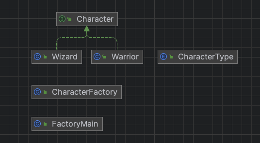

# 팩토리 패턴
- factory : 디자인 패턴에서 객체를 생성하는 부분을 캡슐화하여 위임하는 것

## 목적 및 특징
- 객체의 생성 동작을 별도 클래스로 분리하여 처리
  - 조건에 따라 객체를 다르게 생성해야 하는 경우 주로 활용
- 새로운 객체 생성 시 new 키워드를 코드에 직접 작성하지 않고, 일정한 규격에 맞춘 메서드나 함수를 이용
  - 객체 생성 처리를 규격화하여 관리
  - 강한 연관 관계인 객체를 느슨한 관계로 바꾸고, 느슨한 결합으로 다양한 코드 변화를 처리할 수 있음
- 팩토리 패턴은 객체의 생성 처리를 동적으로 위임하므로, 향후 클래스가 추가되거나 변경돼도 코드를 쉽게 수정 가능

## 팩토리 객체 생성 처리 방법
- 1번) 클래스로 분리
- 2번) 메서드로 분리

## 사용 이유
- 객체 생성을 팩토리에 위임하는 경우 해당 부분이 사용 되는 곳을 다 수정할 필요 없음
- 팩토리 클래스 부분만 수정 시 코드 재사용성이 높아지고, 유지보수가 쉬워짐
- 객체를 직접 생성하는 것은 객체간의 결합도를 강하게 함
  - 결합도가 높아지면 유지보수가 어려워 지기 때문에 이러한 부분을 찾아서 분리 / 캡슐화 하기 위해서 팩토리 패턴을 사용

## 장점
- 코드에서 생성과 관련된 모든 처리를 별도의 클래스 객체로 위임할 수 있음
  - 중복 코드 정리 효과
- 유연성과 확장성 개선
  - 클래스명 변경 등 코드 수정을 팩토리 객체를 통해 손쉽게 변경
- 팩토리 패턴은 어떤 객체 생성할지 모르는 초기 단계 코드에 유용
  - 객체 먼조 호출해서 사용한 후 쉽게 수정 가능

## 단점
- 객체 생성 위임에 별도 클래스 생성 필요
  - 관리 클래스 파일 증가
  - 위 단점은 단순 팩토리 사용으로 해결 가능

## 예시
- 게임 캐릭터 생성하는 팩토리 예시
- Character : 게임 캐릭터 인터페이스
  - <--- Warrior : 전사 캐릭터 구현 클래스
  - <--- Wizard : 마법사 캐릭터 구현 클래스
- CharacterFactory : 게임 캐릭터 생성하는 팩토리 클래스
- FactoryMain : 클라이언트 코드

### diagrams

