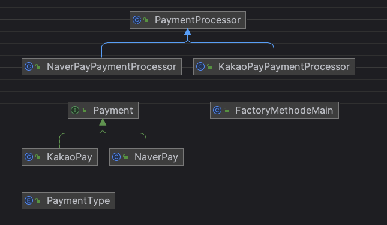

# 팩토리 메서드 패턴
- 디자인 패턴 중 생성 패턴에 속하는 패턴
- 객체 생성을 담당하는 메서드를 서브 클래스에서 구현하도록 하는 디자인 패턴

## 목적 및 특증
- 팩토리를 확장한 패턴
  - 팩토리 패턴과 템플릿 메서드 패턴이 결합된 패턴
- 팩토리 패턴에 추상화를 결합하여 객체의 생성과 사용을 분리
  - 추상 클래스 + 구현 클래스로 분리
- 가장 폭넓게 사용되는 패턴 중 하나
- 선언된 클래스의 객체를 직접 코드로 생성하지 않고 별도로 준비된 추상 메서드에 생성을 위임

## 참고) 팩토리 메서드 VS 템플릿 메서드
- 유사한 패턴
- 해결하려는 목적에 따라 두 패턴 차이 발생

### 공통점
- 추상화를 사용해 객체를 생성
- 추상화 기법을 통해 상위클래스에서 정의를 결정하고 하위클래스에 구체적인 처리를 위임

### 차이점
| 구분      | 상세 설명                                                                                     |
|---------|-------------------------------------------------------------------------------------------|
| 팩토리 메서드 | - 객체 생성을 위한 패턴 - 생성되는 객체의 유형이 여러개 일때 유용 - 객체 생성 방법이 상속을 통해 변경될 수 있는 경우 사용         |
| 템플릿 메서드 | - 알고리즘 구조 정의 후 하위 클래스에서 세부 구현 제공 시 사용 - 공통된 알고리즘 존재하고 하위 클래스에서 일부 단계를 구체화 해야 하는 경우 유용 |

## 예시
- 사용자의 선택에 따라 결제 모듈을 구동하는 시스템을 만드는 예시
- Payment: 결제 모듈 인터페이스
  - KakaoPay: 카카오페이 결제 모듈 구현체
  - NaverPay: 네이버페이 결제 모듈 구현체
- PaymentProcessor: 결재 모듈 실행 팩토리 메서드 추상 클래스(상위클래스)
  - KakaoPayPaymentProcessor: 카카오페이 결재 모둘 생성 및 결제 구현 클래스
  - NaverPaymentProcessor: 네이버페이 결재 모둘 생성 및 결제 구현 클래스
- FactoryMethodMain: 클라이언트 실행 클래스

### diagrams

