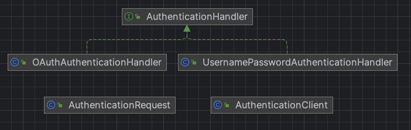

# 책임 연쇄 패턴

> 여러 개의 수신 객체가 발신된 요청을 처리할 수 있도록, 요청의 발신과 수신을 분리한다. 발신된 요청은 해당 요청을 처리할 수 있는 수신 객체를 만날 때까지 체인을 따라 계속 이동한다.
  - GoF의 디자인 패턴

- 1개의 요청을 2개 이상의 객체에서 처리해야 한다면 책임 연쇄(chain of Responsibility) 패턴을 사용

## 특징
- 여러 개의 프로세서 또는 수신 객체가 동일한 요청을 차례로 처리
- 책임에 포함된 각각의 프로세서에는 각자 처리할 책임이 있으므로, 이 패턴을 책임 연쇄 패턴이라 함
- 프레임워크에서 사용하는 필터, 인터셉터, 플러그인을 개발하기 위해 사용

## 구현 방법
1. 프로세서 요청을 처리할 수 있으면 전달 중단, 처리 할 수 없으면 다음 메서드 호출하여 다음 프로세서로 전달
    - GoF 디자인 패턴에서 정의된 책임 연쇄 패턴
        - 체인 내 프로세서가 요청을 처리할 수 있으면 요청이 더 이상 다음으로 전달되지 않음
2. 체임 내 프로세서를 차례대로 요청을 전달하면서 모두 전달

## 장점
- 요청을 보낸 쪽과 받는 쪽을 분리할 수 있음
- 사슬에 들어가는 객체를 바꾸거나 순서를 바꿈으로써 역할을 동적으로 추가하거나 제거할 수 있음

## 단점
- 요청이 반드시 수행된다는 보장이 없음
- 사실 끝까지 갔는데도 처리되지 않을 수도 있음(사실 이런 특징이 장점이 될 수 있음)
- 실행 시에 과정을 살펴보거나 디버깅하기가 힘들다는 단점이 있음

## 활용
- 원도우 시스템에서 마우스 클릭, 키보드 이벤트를 처리할 때 흔히 쓰임

### 참고) 책임 연쇄 패턴 기반의 서블릿 필터
- 서블릿 필터는 HTTP의 인증, 플로우 제한, 로깅, 매개변수 검증과 같은 요청을 필터링 할 수 있음
- 서블릿 필터는 서블릿 사양의 일부분으로, 톰캣, 제티와 같이 서블릿 사양을 지원하는 웹 컨테이너라면 모두 지원
- 필터 추가하려면 javax.servlet.Filter 인터페이스를 구현하는 필터 클래스를 정의한 후, web.xml 설정 파일에 해당 클래스의 내용을 추가하면 됨
    - 웹 컨테이너가 시작되면 web.xml 설정을 통해 필터 객체를 생성
    - 요청이 들어오면 먼저 서블릿 필터에서 요청을 처리한 다음 서블릿에서 처리
- 책임 연쇄 패턴의 일반적인 코드는 핸들러 인터페이스인 IHandler 또는 추상 클래스인 Handler, 핸들러 체인인 HandlerChain이 포함됨
    - 서블릿 필터에 해당하는 javax.servlet.Filter는 핸들러 인터페이스이며 FilterChain은 핸들러 체인임

## 예시
- 로그인 인증 과정을 처리하는 예시
  - 각각의 핸들러로 로그인 요청을 처리할 때 필요한 단계를 수행하고 요청이 처리되지 않으면 다음 핸들러로 전달
- handler
  - AuthenticationHandler: Handler 인터페이스
  - OAuthAuthenticationHandler: OAuth 권한 ConcreteHandler 클래스
  - UsernamePasswordAuthenticationHandler: 유저명, 패스워드 권한 ConcreteHandler 클래스
- AuthenticationClient: 권한 체인 생성 클래스
- AuthenticationRequest: AuthenticationRequest 클래스
- Main: 인증 요청 생성 및 요청 처리하는 메인 실행 클래스

### diagram

