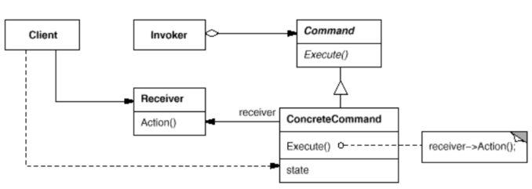
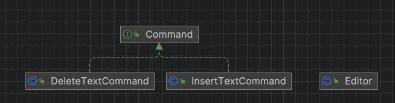

# 커맨드 패턴
- 작업을 요청하는 쪽과 그 작업을 처리하는 쪽을 분리하는 패턴
    - 디자인에 커맨드 객체(command obejct) 추가
    - 커맨드 객체는 일련의 행동을 특정 리시버와 연결함으로써 요청을 캡슐화한 것
- 커맨드 패턴을 사용하면 요청 내역을 객체로 캡슐화해서 객체를 서로 다른 요청 내역에 따라 매개변수화할 수 있음, 이러면 요청을 큐에 저장하거나 로그로 기록하거나 작업 취소 기능을 사용할 수 있음
- 참고) 자주 사용하는 패턴은 아님

> 커맨드 패턴은 요청을 객체로 캡슐화 하여, 다른 객체를 다른 요청, 대기열 요청, 로깅 요청과 함께 매개변수로 전달 할 수 있도록 하며, 취소 가능한 작업을 지원한다.   - GoF의 디자인 패턴

## 특징
- 함수를 객체로 캡슐화 함
- 요청을 객체로 만들어 전달
- 요청을 기록으로 남겨 취소도 가능
- 클라이언트 서버간의 프로토콜로 사용 가능
    - 메뉴, 프로토콜
- command 클래스를 만들고 그 안에 execute 메서드 생성하여 명령 실행

## Class diagram

- **Command :** 각 명령이 수행할 메서드 선언
- **ConcreteCommand :** 실제 명령이 호출되도록 execute 구현
- **Client :** ConcreteCommand 객체를 생성하고 처리 객체로 정의
- **Invoker :** Command 처리를 수행할 것을 요청
- **Receiver :** Command 처리

## 장점
- 명령 자체를 객체화 하여 여러 다른 객체에 명령이 전달되거나 명령이 조합될 수도 있음
- 새로운 프로토콜이 추가되기 쉬움

## 단점
- 부가적인 정보가 많은 경우는 비효율적일 수 있음

## 커맨드 패턴과 전략 패턴의 차이
- 디자인 패턴 간의 차이는 주로 응용 시나리오에서 달라짐
- 전략 패턴
    - 각각의 전략은 동일한 목적을 갖지만 서로 다른 구현 방식을 사용
    - 서로 대체 가능
        - 버블정렬클래스와 선택전렬 클래스는 모두 정렬에 사용되는 클래스로 구현 방식은 다르지만 결과는 같음
- 커맨드 패턴
    - 각가의 명령은 서로 다른 목적을 가지는 다른 처리 방식을 가지고 있기 때문에 서로 대체 불가

## 예시

### diagram

