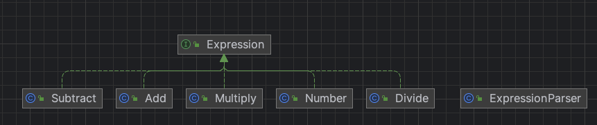

# 인터프리터 패턴
> 인터프리터 패턴은 언어에 대한 문법을 정의하고, 이 문법을 처리하기 위한 인터프리터를 정의한다.
  - GoF의 디자인 패턴

- 인터프리터 패턴은 문법 규칙에 따라 문장을 해석하는 데 사용 되는 통역사

## 특징
- 간단한 언어 인터프리터를 구축하는 방법을 설명하는데 사용
- 커맨드 패턴에 비해 응용 범위가 작으며, 컴파일러, 규칙, 엔진, 정규식과 같은 일부 특정 영역에서 사용
    - 예) 한국어 문자 입력 시 문법 규칙에 따라 영어 문장으로 번역할 수 있는 번역기 개발
        - 번역기가 인터프리터 패턴의 정의에서 말하는 인터프리터
- 인터프리터 패턴의 코드는 고정 템플릿이 없어서 매우 유연
- 인터프리터 패턴에서 가장 중요한 개념
    - 각각의 분석 책임을 클래스로 분할하는 방식을 통해, 크고 포괄적인 분석 클래스를 만들지 않는 것
    - 일반적으로 문법 규칙을 몇 개의 작은 독립 단위로 분할한 다음, 각 단위별로 분석을 마치면 전체 문법 규칙 분석으로 통합하는 것

## 활용법
- 효율 보다는 단순하고 간단하게 문법을 만드는 것이 더 중요한 경우 유용
- 스크립트 언어와 프로그래밍 언어에서 모두 쓸 수 있음

## 장점
- 문법을 클래스로 표현해서 쉽게 언어를 구현
- 문법이 클래스로 표현되므로 언어를 쉽게 변경하거나 확장할 수 있음
- 클래스 구조에 메소드만 추가하면 프로그램을 해석하는 기본 기능 외에 예쁘게 출력하는 기능이나 더 나은 프로그램 확인 기능 같은 새로운 기능 추가가 가능

## 단점
- 문법 규칙의 개수가 많아지면 아주 복잡해진다는 단점이 있음
    - 그럴 때는 파서나 컴파일러 생성기를 쓰는 편이 나음

## 예시
- Expression: 추상 표현식 클래스 
- ExpressionParser: 표현식 처리 클래스
- Number: 숫자 표현식 클래스
- 사칙 연산 클래스
  - Add: 덧셈 표현식 클래스
  - Subtract: 뻬기 표현식 클래스
  - Divide: 나누기 표현식 클래스
  - Multiply: 곱하기 표현식 클래스
- Main: 텍스트 기준으로 표현식으로 사칙연산 진행하는 클라이언트 클래스

### diagram

