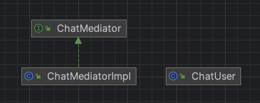

# 중재자 패턴
> 중재자 패턴은 객체 컬렉션 간의 상호 작용을 캡슐화하는 별도의 중재자 객체를 정의하고, 객체 간의 직접적인 상호 작용을 피하기 위해 상호 작용을 중재자 객체에게 위임한다.
  - GoF의 디자인 패턴

- 중재자 패턴은 객체 간의 상호 작용을 캡슐화하여 객체가 서로 직접 참조하지 않도록 하고 중재자 객체를 통해 상호 작용할 수 있도록 하는 디자인 패턴
- 이 패턴은 유지 관리가 용이하며 객체 간의 결합도를 낮추는 데 도움

## 특징
- 중재를 위한 중간 계층을 도입하여 객체 컬렉션 간의 상호 작용 관계나 의존성을 네트워크 형태의 다대다 관계에서 위성 형태의 일대다 관계로 변환함
    - 원래 여러 객체와 직접 상호 작용해야 했던 객체는 이제 객체 간의 상호 작용을 최소화하기 위해 하나의 중간 객체와 상호 작용하며, 이로 인해 코드의 복잡도가 낮아지고 코드의 가독성과 유지 보수성이 향상됨
- 구현 코드가 간단하며, 옵저버 패턴과 다수 유사
- 중재자 패턴은 상호 작용 복잡도를 낮추는 것 외에도 조정이라는 중요한 역할을 함

### 중재자 패턴의 매우 전형적인 예시
- 항공 제어
    - 모든 비행기가 서로 통신하며 위치 확인 시 통신 네트워크가 복잡해 짐
    - 관제탑이라는 중재자가 각각의 비행기와 통신하면서 자신의 위치를 전송하고, 관제탐은 모든 항고기의 경로 설정과 일정을 담당함으로써 통신 네트워크를 크게 단순화 할 수 있음
- 인스턴스 메시지 시스템
    - 사용자 장치에서 먼저 메시지를 서버에 보내면, 서버는 대상 사용자 장치에 메시지를 보냄
    - 메시지를 보내는 장치는 메시지를 받는 장치와는 직접 상호작용 하지 않음

## 장점
- 객체 간의 결합도가 낮아져 유연성이 향상됨
- 복잡한 객체 간의 상호작용을 쉽게 구현할 수 있음

## 단점
- 중재자 객체가 복잡해질 수 있음
    - 이로 인해 단일 책임 원칙(Single Responsibility Principle)을 위배할 수 있음
- 중재자 객체가 중요한 역할을 수행하므로 성능 저하의 원인이 될 수 있음

## 예시
- ChatMediator: 중재자 인터페이스
- ChatMediatorImpl: 중재자 구현 클래스, 객체 컬렉션 구성으로 가짐
- ChatUser: 중재자로 소통하는 채팅 유저 객체
- ChatClientMain: 채팅 클라이언트 실행 클래스

### diagram

