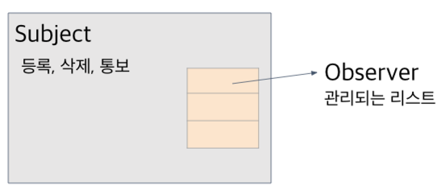
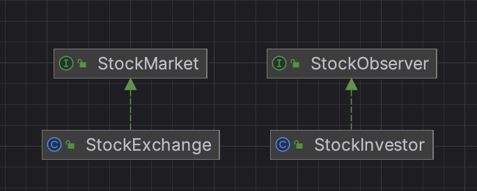

# 옵저버 패턴

- **옵저버(관찰자)들이 관찰하고 있는 대상자의 상태가 변화가 있을 때마다 대상자는 직접 목록의 각 관찰자들에게 통지하고, 관찰자들은 알림을 받아 조치를 취하는 행동 패턴**

> 많은 객체들 사이에서 일대일 의존 관계가 정의되어 있을 때, 어느 한 객체의 상태가 변경되면 이 객체에 의존하고 있는 모든 객체는 자동으로 알림을 받는다. <br> - GoF의 디자인 패턴

## 옵저버 패턴 특징
- 옵저버 패턴은 발행-구독 패턴(publish-subscribe pattern)이라고도 함
    - 옵저버 패턴은 여러 개의 주제와 메시지 유형이 있는 복잡한 상황에서 사용하는 출판-구독 패턴과 친척
- 주제와 옵저버로 일대다 관계가 정의됨
    - 옵저버는 주제에 딸려 있으며 주제의 상태가 바뀌면 옵저버에게 정보가 전달됨
- 옵저버 패턴은 여러 가지 방법으로 구현할 수 있지만, 보통은 Subject Interface, Observer Interface가 들어있는 클래스 디자인으로 구현
- 어떤 객체의 상태를 느슨하게 결합된 다른 객체에 전달하는 패턴
- 옵저버 패턴을 사용하면 주제가 데이터를 보내거나(푸시 방식) 옵저버가 데이터를 가져올(풀 방식) 수 있음
    - 일반적으로 풀 방식이 더 ‘옳은 방식’이라고 간주

- 참고) 푸쉬와 풀
    - 푸쉬 push : 주제가 옵저버로 데이터를 보내는 것
    - 풀 pull : 옵저버가 주제로부터 데이터를 당겨오는 것

- 참고) 느슨한 결합 Loose Coupling
  - 객체를 동적으로 결합하면 강력한 결합 구조가 아닌 느슨한 결합 구조로 구성됨
  - 객체들이 상호작용할 수는 있지만, 서로를 잘 모르는 관계를 의미
  - 느슨한 결합을 활용하면 유연성이 아주 좋아짐
  - 옵저버 패턴은 느슨한 결합을 보여주는 훌륭한 예
    - 감시자 패턴은 의존성을 가지지만 결합된 모든 감시자 객체의 세부 내용은 알 필요 없고 독립적 실행이 가능한 개별 객체임
        - 이러한 독립적 특성은 감시자 패턴의 장점
    

### 옵저버가 느슨한 결합을 만드는 방법
- 주제는 옵저버가 특정 인터페이스(Observer Interface)를 구현한다는 사실만 앎
    - 옵저버의 구상 클래스가 무엇인지, 옵저버가 무엇을 하는지는 알 필요도 없음
- 옵저버는 언제든지 새로 추가할 수 있음
    - 주제는 옵저버 인터페이스를 구현하는 객체의 목록에만 의존하여 옵저버를 언제든지 추가, 삭제 할 수 있음
- 새로운 형식의 옵저버를 추가할 때도 주제를 변경할 필요가 전혀 없음
    - 새로운 옵저버가 추가되더라도 옵저버 인터페이스를 구현하고 옵저버를 등록하면 됨
- 주제와 옵저버는 서로 독립적으로 재사용할 수 있음
    - 주제나 옵저버를 다른 용도로 활용할 일이 있다 해도 손쉽게 재사용할 수 있음
    - 둘이 서로 단단하게 결합되어 있지 않기 때문
- 주제나 옵저버가 달라져도 서로에게 영향을 미치지 않음
    - 느슨하게 결합되어 주제나 옵저버 인터페이스를 구현한다는 조건만 만족한다면 어떻게 고쳐도 문제가 생기지 않음


## 옵저버 패턴 구성 요소
- (Interface) Subject : 주체, 의존 대상이 되는 객체, 피관찰자
    - 동의어 - 옵저어블, obserable, Publisher, Producer, EventEmitter, Dispatcher
    - 상태를 가지는 클래스
    - 상태의 변경 발생 시 실제 동작하는 객체(Observer)에 통보하거나 갱신 작업을 통보
- (구현체) concreteSubject : 실제 주체

- (Interface) observer: 의존하고 있는 객체, 관찰자
    - 동의어 - 옵저버, Subscriber, Consumer, EventListener, Listener
    - 주체의 변경 발생 시 전달 받는 객체
- (구현체) concreteObserver: 실제 객체

- 2개 그룹으로 구분
    - 통보를 위한 주체 - 실제 주체 클래스
        - 객체의 등록, 삭제, 통보를 담당하는 클래스
        - 실제 처리하는 객체를 관리하고 관리를 담당하는 주체는 1개 이상의 옵저버 객체를 갖고 있음
        - 
    - 처리를 위한 옵저버 - 실체 객체 클래스
        - 통보를 수신 받아 처리하는 객체
        - 통보 받기 위해서는 주체 클래스에 수신 받는 객체를 등록해야 함
        - 보통은 주체로 부터 수동적으로 통보 받지만, 필요 시 능동적으로 서브 객체 상태를 주체로 전달하기도 함


## 옵저버 패턴 코드 구현(고전적 방식)
```java
public interface Subject {
	void registerObserver(Observer observer);
	void removeObserver(Observer observer);
	void notifyObservers(Message message);
}

public interface Observer {
	void update(Message message);
}

public class ConcreteSubject implements Subject {
	private List<Observer> observers = new ArrayList<>();

	@Override
	public void registerObserver(Observer observer) {
		observers.add(observer);
	}

	@Override
	public void removeObserver(Observer observer) {
		observers.remove(observer);
	}

	@Override
	public void notifyObservers(Message message) {
		for (Observer observer : observers) {
			observer.update(message);
		}
	}
}

public class ConcreteObserverOne implements Observer {
	@Override
	public void update(Message message) {
		// TODO: 메시지 알림을 받고 코드 실행
		System.out.println("ConcreteObserverOne is notified.");
	}
}

public class ConcreteObserverTwo implements Observer {
	@Override
	public void update(Message message) {
		// TODO: 메시지 알림을 받고 코드 실행
		System.out.println("ConcreteObserverTwo is notified.");
	}
}

public class Demo {
	public static void main(String[] args) {
		ConcreteSubject subject = new ConcreteSubject();
		subject.registerObserver(new ConcreteObserverOne());
		subject.registerObserver(new ConcreteObserverTwo());
		subject.notifyObservers(new Message());
	}
}
```
- 위 코드는 옵저버 패턴의 템플릿 코드로, 옵저버 패턴의 일반적인 설계 살펴 볼 수 있음
    - resister는 attach, remove는 detach로 대체 가능

## 옵저버 패턴 목적

- 행동 패턴은 행동 코드를 디커플링하는 것이 목적
- 옵저버 패턴은 옵저버의 코드와 옵저버블의 코드를 디커플링 함

## 옵저버 패턴 활용
- 상태를 직접 관찰하지 않고 불특정 다수의 객체에 통보할 때 유용
- 하드웨어 분야에서 많이 사용 됨
    - 상태값 변경 시 신호로 통보, 신호 수신 시 인터럽트 등 처리 발생해 상태 처리

### 라이브러리 속 옵저버 패턴
- JDK에 있는 자바빈(javaBean)과 스윙(swing) 라이브러리
    - 자바빈 옵저버 패턴 - PropertyChangeListener
    - 스윙 - JButton 슈퍼클래스 AbstractButton
        - 리스너 추가 제거 메서드 : 스윙 구성 요소에서 일어나는 다양한 유형의 이벤트를 감시하는 옵저버(스윙 라이브러리에서는 리스너라고 부름)
- 자바외에 자바스크립트의 이벤트, 코코아와 스위프트의 키-값 옵저빙 프로토콜

### 관련 패턴
- 중재자 패턴(mediator)
    - 객체간의 직접 통신한느 것이 아니라 중심 객체가 통신을 중재, 감시자 패턴 함께 사용
    - 감시자 패턴은 상태만 통보, 중재자는 역할 조정을 목적으로 통보
- MVC
    - M(데이터베이스 모델), V(화면 구성하는 뷰)
    - 모델이 주체에 해당하고 뷰가 감시자 역할을 수행하는 구조로 설계


## 예시
- Subject
  - StockMarket: Subject Interface, 주제에 대한 인터페이스, 옵저버 등록, 삭제, 알림, 데이터 세팅 등의 책임을 가짐
  - StockExchange: Subject 구현체, 옵저버들을 필드로 관리하며, 실제 실행 코드가 구현된 클래스
- Observer
  - StockObserver: Observer Interface, 데이터를 업데이트 받는 메서드를 가지는 인터페이스 
  - StockInvestor: Observer 구현체, 데이터 업데이트 후 실행되는 코드 클래스
- Main : 주식 시장을 생성 후 옵저버인 투자자들에게 알림을 주는 메인 클래스
### diagram

