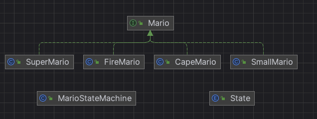

# 상태 패턴
- 객체의 내부 상태가 바뀜에 따라 객체의 행동을 바꿀 수 있음
- 객체의 클래스가 바뀌는 것과 같은 결과를 얻을 수 있음

## 특징
- 상태 변경의 동적인 처리 가능
    - 상태 패턴 사용 시 런타임 시에 상태를 동적으로 변경 가능
- 복잡한 상태에 따른 동작의 조건문 제거 가능

## 상태 머신 구현 방법
- 상태 패턴은 다른 이벤트에 의해 촉발된 상태 전이와 동작 실행을 다른 상태 클래스로 분할하여 분기 판단 분기를 회피함

## 활용
- 게임에서 상태에 따라 다른 동작을 구현할 때 사용
    - 예) 마리오 → 버섯 획득 → 슈퍼마리오 변신
        - 꼬마 마리오, 슈퍼 마리오, 파이어 마리오, 망토 마리오
- 주문 처리 시스템
    - 주문 준비중, 준비 완료, 배송 대기, 배송 완료 등으로 상태 변경하며 처리
- 자판기
    - 자판기의 상태 기준으로 처리
        - 판매 가능, 판매 중, 판매 중지, 고장, 동전투입 등
## 유사 패턴
- 상태 패턴과 전략 패턴과 다이어그램 똑같음
    - 단, 용도가 다름
- 상태 패턴 vs 전략 패턴
    - 상태 패턴
        - 상태 객체에 일련의 행동이 캡슐화
        - 상황에 따라 Context 객체에서 여러 상태 객체 중 한 객체에게 모든 행동을 맡기게 됨
        - 그 객체의 내부 상태에 따라 현재 상태를 나타내는 객체의 행동도 자연스럽게 바뀌게 됨
            - 클라이언트는 객체의 상태를 몰라도 됨
        - Context 객체에 수많은 조건문을 넣는 대신 상태 패턴 사용
    - 전략 패턴
        - 클라이언트가 Context 객체에게 어떤 전략 객체를 사용할지를 지정해 줌
        - 전략 패턴은 주로 실행 시에 전략 객체를 사용할지를 지정해 줌
        - 주로 실행 시 전략 객체를 변경할 수 있는 유연성을 제공하는 용도로 쓰임
        - 유연성을 극대화하는 용도로 쓰임
            - 구성으로 행동을 정의하는 객체를 유연하게 변경 가능

## 예시
- mario: 마리오 관련 패키지
  - Mario: 마리오 기본 기능 인터페이스
  - SmallMario: 기본 스몰 마리오 구현 클래스
  - SuperMario: 버섯을 먹은 슈퍼 마리오 구현 클래스
  - CapeMario: 망토 먹은 망토 마리오 구현 클래스
  - FireMario: 불꽃 먹은 파이어 마리오 구현 클래스
- State: 마리오의 상태와 점수 가지고 있는 enum
- MarioStateMachine: 마리오 상태 머신 클래스, 상태 관리
- GamePlay: 게임 플레이하는 클라이언트 메인 클래스

### diagram

