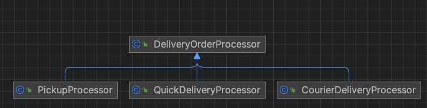

# 템플릿 메서드 패턴
> 템플릿 메서드 패턴은 하나의 메서드 안에 정의된 알고리즘 골격으로, 일부 작업 단계를 하위 클래스로 넘길 수 있어 하위 클래스가 알고리즘의 전체 구조를 변경하지 않고 알고리즘의 일부 단계를 재정의 할 수 있다.
<br> - GoF의 디자인 패턴

- 상위 클래스에서는 전체적인 흐름을 구현하고 구체적인 처리는 하위 클래스에 위임
- 템플릿 메서드는 알고리즘의 각 단계를 정의하며, 서브클래스에서 일부 단계를 구현할 수 있도록 유도
- 템플릿 메서드 패턴은 알고리즘의 골격을 정의
- 템플릿 메서드를 사용하면 알고리즘의 일부 단계를 서브클래스에서 구현할 수 있으며, 알고리즘의 구조는 그대로 유지하면서 알고리즘의 특정 단계를 서브클래스에서 재정의 할 수도 있음
    - 알고리즘은 넒은 의미의 비즈니스 논리에 가까움
- 간단하게 말하자면 템플릿 메서드 패턴은 알고리즘의 템플릿(틀)을 만듦
    - 일련의 단계로 알고리즘을 정의한 메서드
    - 여러 단계 가운데 하나 이상의 단계가 추상 메서드로 정의
    - 그 추상 메서드는 서브클래스에서 구현 됨
        - 서브클래스가 일부분의 구현을 처리하게 하면서 알고리즘의 구조는 바뀌지 않음


## 예제 코드
- 템플릿 메서드 패턴은 아래와 같은 형태로 구현함
    - AbstractClass : 템플릿 메서드가 포함된 추상 클래스, 구현된 메서드가 포함되기도 함
        - 하위에서 재정의를 피하기 위해 templateMethod() 는 final로 선언
    - ConcreteClass : AbstractClass 를 상속 받아 변경되는 알고리즘을 세부 로직을 구현하는 서브클래스

```java

public abstract class AbstractClass {
    public final void templateMethod() {
        ...
        method1();
        ...
        method2();
        ...
    }
    
    protected abstract void method1();
    protected abstract void method2();
}

public class ConcreteClass1 extends AbstractClass {

    @Override
    protected void method1() {
        ...
    }

    @Override
    protected void method2() {
        ...
    }
}

public class ConcreteClass2 extends AbstractClass {

    @Override
    protected void method1() {
        ...
    }

    @Override
    protected void method2() {
        ...
    }
}
```

## 템플릿 메서드 패턴 활용
### 재사용 역할
- Java의 InputStream 클래스
    - read() : 데이터를 읽는 전 과정을 정의하는 템플릿 메서드, 하위 클래스 별로 정의된 추상 메서드를 노출
- Java의 AbstractList 클래스
    - addAll() : 템플릿 메서드, add()는 하위 클래스가 재정의 해야 하는 메서드에 해당

### 확장 역할
- Java의 서블릿
    - HttpServlet을 상속하는 클래스를 정의하고 get 요청을 처리하는 doGet() 메서드와 post 요청을 처리하는 doPost() 메서드를 재정의하면 됨
    - HttpServlet 클래스의 service() 메서드는 실제로 전체 HTTP 요청 프로세스를 포함하는 템플릿 메서드
        - doGet(), doPost() 메서드는 템플릿의 일부로 하위 클래스에서 재정의 가능
- JUnit의 TestCase 클래스
    - TestCase 클래스의 runBare() 함수는 테스트 케이스의 전체 흐름을 정의하는 템플릿 메서드
        - 먼저 setUp() 실행하여 준비 작업 수행 후 runTest() 실행하여 실제 테스트 코드를 실행하고, 마지막으로 tearDown() 메서드로 테스트에 사용된 리소스 등을 정리
        - setUp(), tearDown()은 추상 함수가 아니여서 하위 클래스에게 구현을 강제하지 않지만, 재정의가 가능해서 템플릿 메서드 패턴이라 할 수 있음

## 템플릿 메소드 속 후크
- 후크(hook)는 추상 클래스에서 선언되지만 기본적인 내용만 구현되어 있거나 아무 코드도 들어가 있지 ㅇ낳은 메서드
    - 서브클래스는 다양한 위치에서 알고리즘에 끼어들 수 있고, 무시하고 넘어갈 수도 있음
    - 후크가 있으면 메서드를 오버라이드 할수도 있고 그냥 넘어갈수도 있음(오버라이드 하지 않으면 추상 클래스에서 기본으로 제공한 코드가 실행됨)
- 예시) 고객에게 입력 받은 데이터를 기준으로 템플릿 메서드 내의 특정 메서드를 진행하지 않게 처리 가능
```java
public abstract class CaffeinBeverageWithHook {
    final void prepareRecipe() {
        boilWater();
        brew();
        pourInCup();
        if (customerWantsCondiments()) {
            addCondiments();
        }
    }

    ...
    // 서브 클래스에서 오버라이드 해서 변경 가능
    boolean customerWantsCondiments() {
        return true;
    }
}
```


## 템플릿 메서드 설계시 고려
- 추상 메서드 수
    - 추상 메서드가 너무 많은 경우 서브클래스에서 일일이 추상 메서드 구현해야 함
        - 알고리즘의 담계를 너무 잘게 쪼개지 않는 것도 한가지 방법
    - 알고리즘을 큰 단계로만 나누면 유연성이 떨어진다는 단점도 있음
- 후크 사용
    - 알고리즘에서 필수적이지 않은 부분을 서브클래스에서 구현하도록 하고 싶을 때 사용 가능
    - 서브클래스가 추상 클래스에서 진행되는 작업을 할지 말지 결정하는 기능으로도 후크 사용 가능
    - 모든 단계가 필수일 필요는 없음
        - 필수가 아닌 부분을 후크로 구현하면 그 추상 클래스의 서브클래스를 만들 때 부담이 줄어듦

## 장점
- 코드 재사용에 큰 도움이 됨
- 유연성 증가
- 알고리즘 전체 구조 명확하게 확인 가능

## 단점
- 복잡성이 증가함, 상속을 기반으로 해서 클래스 간의 결합 초래 가능
- 일부 클라이언트들은 알고리즘의 제공된 골격에 의해 제한될 수 있음

## 예시
- 상품 배송에 대한 템플릿 메서드 패턴 구현 예시
- DeliveryOrderProcessor: 템플릿 메서드와 공통 구현 메서드가 있는 배송 주문 처리 추상 클래스
  - CourierDeliveryProcessor: 택배 배송 처리 구현 서브 클래스
  - PickupProcessor: 직접 수령 처리 구현 서브 클래스
  - QuickDeliveryProcessor: 퀵 배송 처리 구현 서브 클래스

### diagram

