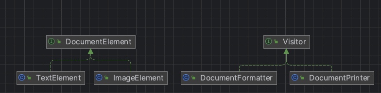

# 비지터 패턴
> 하나 이상의 작업을 객체 집합에 적용하여 객체에서 작업을 분리할 수 있다.
  - GoF의 디자인 패턴

- 다양한 객체에 새로운 기능을 추가해야 하는데 캡슐화가 별로 중요하지 않다면 비지터 패턴 사용 가능
- 22개의 고전 디자인 패턴 중 가장 이해하기 어려운 패턴
- 적용 시 코드의 가독성과 유지 보수성이 떨어지기 때문에 실제로 거의 사용되지 않음
    - 매우 특수한 상황에서만 비지터 패턴을 고려함
- 구조 안을 돌아다니며 일을 하는 “방문자”

## 특징
- 객체 구조의 요소들이 수행해야할 기능을 모아둔 패턴
- 각 객체 요소를 변경하지 않고, 기능을 추가할 수 있음
- 데이터의 구조와 처리를 분리하여 처리하는 부분을 객체로 만들어 각 데이터 구조를 돌아다니며 오퍼레이션이 수행되도록 함
- 각 데이터는 이러한 visitor를 accept 함
- 새로운 요소 클래스를 추가하게 되면 그에 해당되는 기능을 모든 Visitor에서 구현해야 함

## 적용
- 비지터 객체는 복잡한 객체 구조(예 : 객체 트리)의 모든 요소에 대해 작업을 수행해야 할 때 사용
- 비지터 패턴을 사용하여 보조 행동들의 비즈니스 로직을 정리
- 이 패턴은 행동이 클래스 개층구조의 일부 클래스들에서만 의미가 있고 다른 클래스들에서는 의미가 없을 때 사용하면 됨
- 각 클래스에 대한 기능이 자주 변경되거나 알고리즘의 변화가 많을때 사용하는것이 효율적임
- 요소의 변화가 거의 없고 기능의 추가 삭제가 자주 발생할때 사용하는것이 좋음

## 장점
- 구조를 변경하지 않으면서도 복합 객체 구조에 새로운 기능을 추가할 수 있음
- 비교적 손쉽게 새로운 기능 추가 가능
- 비지터가 수행하는 기능과 관련된 코드를 한곳에 모아 둘 수 있음
- 개방/폐쇄 원칙을 지킬 수 있음
- 비지터 객체는 다양한 객체들과 작업하면서 유용한 정보를 축적할 수 있음
    - 객체 트리와 같은 복잡한 객체 구조를 순회하여 이 구조의 각 객체에 비지터 패턴을 적용하려는 경우에 유용할 수 있음

## 단점
- 비지터를 사용하면 복합 클래스의 캡슐화가 깨짐
- 컬렉션 내의 모든 항목에 접근하는 트래버서가 있으므로 복합 구조를 변경하기가 더 어려워 짐
- 클래스가 요소 계층구조에 추가되거나 제거될때마다 모든 비지터를 업데이트 해야 함
- 비지터들은 함께 작업해야 하는 요소들의 비공개 필드들 및 메서드들에 접근하기 위해 필요한 권한이 부족할 수 있음

## 예시
- visitor: visitor 패키지
  - Visitor: visitor 인터페이스
  - DocumentFormatter: 문서를 서식을 적용하여 출력하는 visitor 구현체
  - DocumentPrinter: 문서를 인쇄하는 visitor 구현체
- DocumentElement: 문서 요소를 나타내는 인터페이스
- TextElement: 텍스트 요소를 나타내는 클래스
- ImageElement: 이미지 요소를 나타내는 클래스
- Main: 클라이언트 메인 코드

### diagram

