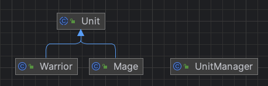

# 프로토타입 패턴
- 프로토타입 패턴은 객체를 새로 생성하지 않고 복제를 통해 자원을 절약하는 패턴
  - 복잡한 구조의 객체를 새로 생성하는 것은 많은 자원을 소모함
- 클래스의 인스턴스가 생성과정이 복잡하거나 여러 조합에 의해 생성되어야 하는 경우 하나의 견본(prototype)을 만들어 초기화해두고 이를 복제해서 객체를 생성하는 방법

## 특징
- 원본 객체를 보존하면서 필요할 때마다 동적으로 객체를 생성할 수 있음
- 객체의 타입이 런타임에 결정될 수 있음
  - 프로토타입 패턴은 객체의 타입을 알지 못해도 복제를 통해 새로운 객체를 생성할 수 있는 유연성 제공
- 기존 인스턴스를 복사하기만 해도 새로운 인스턴스를 만들 수 있음
    - 자바에서는 clone() 메서드를 사용하거나 역질렬화를 하면 됨

## 장점
- 객체 생성 과정이 복잡한 경우 유용
- 런타임에 객체의 타입을 동적으로 결정할 수 있음
- 클라이언트는 새로운 인스턴스를 만드는 과정을 몰라도 됨
  - 클라이언트는 구체적인 형식을 몰라도 객체를 생성할 수 있음

## 단점
- 때때로 객체의 본사본을 만드는 일이 매우 복잡할 수 있음
- 객체의 복제가 어려운 경우 사용하기 어려움
    - 객체가 깊은 복사를 필요로 하는 경우에는 구현이 복잡해 질 수 있음
- 프로토타입 객체의 상태가 변경되면 생성된 모든 복제 객체의 상태도 변경될 수 있음
    - 의도치 않은 부작용 일으킬 수 있으므로 주의 필요

## 활용
- 게임 개발에서 많이 사용
    - 유형별 캐릭터나 아이템을 효율적으로 생성해야 하는 경우 사용
- 문서 생성 시 다양한 형식의 문서를 생성해야 하는 경우 복제해서 새로운 문서 생성
- 시스템에서 복잡한 클래스 계층구조에 파묻혀 있는 다양한 형식의 객체 인스턴스를 새로 만들어야 할 때 유용하게 사용 가능

## 예시
- character: 캐릭터 관련 패키지
  - Unit: 게임 유닛 추상 클래스
  - Warrior: 워리어 유닛 구현 클래스
  - Mage: 마법사 유닛 구현 클래스
- UnitManager: 유닛 등록 및 유닛 생성 매니저 클래스
- GameMain: 유닛 매니저로 게임 유닛 생성하고 플레이하는 클라이언트 메인 클래스

### diagram

