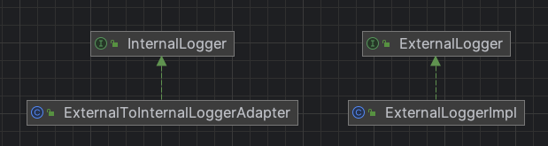

# 어탭터 패턴
- 호환되지 않는 인터페이스를 호환 가능한 인터페이스로 변환하여 두 클래스를 함께 작동할 수 있게 하는 패턴

## 특징
- 클라이언트와 구현된 인터페이스를 분리할 수 있음
    - 변경 내역이 어댑터에 캡슐화 되어 나중에 인터페이스가 바뀌더라도 클라이언트를 바꿀 필요가 없음
- 예) USB 어댑터, 여행용 어댑터
- 특정 클래스 인터페이스를 클라이언트에서 요구하는 다른 인터페이스로 변환
    - 인터페이스가 호환되지 않아 같이 쓸 수 없었던 클래스를 사용할 수 있게 도와줌

## 장점
- 호환성을 유지하면서 새로운 기능을 추가하거나 코드 통합 가능
- 단일 책임 원칙. 프로그램의 기본 비즈니스 로직에서 인터페이스 또는 데이터 변환 코드 분리 가능

## 단점
- 다수의 새로운 인터페이스와 클래스 추가 필요해서 코드 복잡성 증가

## 어댑터 패턴 종류
- 클래스 어댑터
    - 상속 관계를 사용한 방식
    - Adaptee 클래스를 extends 하고, Target을 implements 함
    - Adaptee 인터페이스가 많지만, Adapter와 Target 인터페이스의 정의가 대부분 같으면 Adapter 클래스가 상위 클래스 Adaptee의 인터페이스를 재사용할 수 있으므로 클래스 어댑터 사용하는 것이 좋음
        - 실제로 객체 어댑터에 비해 클래스 어댑터 코드가 더 작음
- 객체 어댑터
    - 합성 관계를 사용한 방식
    - Adaptee 클래스는 구성으로 가지고, Target을 implements 함
    - Adaptee 인터페이스가 많고, Adaptee와 Target 인터페이스의 정의가 대부분 다르다면, 상속 구조보다 유연한 합성 구조 기반의 객체 어댑터 사용하는 것이 좋음

## 어댑터 패턴 사용 케이스
- 어댑터 패턴이 사용되는 것은 인터페이스의 비호환성에서 비롯됨
1. 결함이 있는 인터페이스 설계가 캡슐화 된 경우
    - 인터페이스를 다시 캡슐화해서 높은 사용성과 테스트 용이성을 가진 인터페이스로 재구축하고 싶은 경우 사용
2. 여러 클래스의 인터페이스 설계를 통합할 경우
3. 사용중인 외부 시스템을 교체해야 할 경우
4. 이전 버전 인터페이스와 호환성이 필요한 경우
    - 버전을 업그레이드 할 때 더 이상 사용되지 않는 인터페이스를 직접 삭제하는 대신, deprecated 로 설정한 후 내부 동작을 새 인터페이스 구현에 위임할 수 있음
5. 다양한 형식의 데이터에 적응해야 할 경우
    - 서로 다른 시스템에서 가져온 정보 데이터의 형식이 다르므로 저장과 사용을 위해 동일한 형식으로 통합하는 경우 사용

### 사용 예시
- Java의 Arrays.asList() 는 일종의 데이터 어댑터
    - 배열 형태의 데이터를 컨테이너 형태로 변환해주는 역할
    - List<String> list = Arrays.asList(”A”, ”B”, ”C”)
- 자바 로깅과 어댑터 패턴
    - 자바에서는 Log4j, Logback 같은 많은 로깅 프레임워크가 있고, 개발 시 로그 정보 출력 시 사용
    - 대부분의 로깅 프레임워크는 debug, info, warn, error 같은 다양한 수준의 로그를 출력하는 유사한 기능을 제공하고 있지만, 인터페이스는 모두 다름
    - SLF4J 로깅 프레임워크는 로그 출력을 위한 통합된 인터페이스 사양을 제공
        - 이 프레임워크는 구체적인 구현 코드 없이 인터페이스만 제공하고 있어서 결과적으로 Log4j, Logback과 같은 다른 로깅 프레임워크와 함께 사용해야 함
        - SLF4J는 서로 다른 로그 프레임워크를 다시 캡슐화하고 통합된 인터페이스 정의에 적용
            - 다양한 로깅 프레임워크에 대한 어댑터 제공

## 래퍼 패턴
- 프록시, 데코레이터, 어댑터 패턴은 래퍼 패턴으로 구분함
- 래퍼 패턴은 원본 클래스를 래퍼 클래스를 통해 두 번 캡슐화 하는 패턴
- 프록시 패턴: 클래스를 외부에서 제어하는 것이 주 목적
- 데코레이터 패턴: 원본 클래스의 인터페이스 변경 없이 원본 클래스의 기능을 향상 시키고, 중컵 사용을 지원하는 사후 수정 전략이 주 목적
- 어댑터 패턴: 원본 클래스와 다른 인터페이스를 제공하는 것이 목적

## 예시
- 로그 예시
  - 외부 라이브러리의 로깅을 우리의 애플리케이션에서 사용하기 위해 SLF4J와 연동
### diagram

