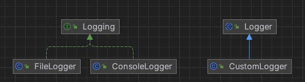

# **Bridge Pattern**
> 추상화와 구현을 디커플링해야만 두 가지가 서로 독립적으로 변화할 수 있다. 
  - GoF의 디자인 패턴

- 기능의 계층과 구현의 계층을 분리함
- 추상화와 구현을 분리하여 각각을 독립적으로 변경할 수 있게 함
- 구현과 더불어 추상화 부분까지 변경해야 하는 경우 사용 하는 패턴

## 특징
- 기능의 확장과 구현의 확장을 따로 계층화 함
- 기능에 대한 여러가지 구현을 다양하게 적용할 수 있음
- 상속을 사용하여 구현을 확장하는 대신, 객체 구현을 별도의 계층으로 유지해서 클래스간의 의존성이 줄어들어 복잡성이 감소함

## 장점
- 구현과 인터페이스를 완전히 결합하지 않았기에 구현과 추상화 부분을 분리 할 수 있음
- 추상화된 부분과 실제 구현 부분을 독립적으로 확장할 수 있음
- 추상화 부분을 구현한 구상 클래스가 바뀌어도 클라이언트에는 영향을 끼치지 않음

## 단점
- 디자인이 복잡해진다는 단점이 있음
    - 올바른 구현과 추상화의 분리를 위해 초기 설계가 중요함, 오히려 더 복잡해 질 수 있음

## 활용
- 여러 플랫폼에서 사용해야 하는 그래픽스와 윈도우 처리 시스템에서 유용하게 쓰임
- 인터페이스와 실제 구현할 부분을 서로 다른 방식으로 변경해야 할 때 유용하게 쓰임
- 자바 SLF4J 로깅 프레임워크에서도 브릿지 패턴 적용
    - 3개의 차원 Logger, Appender, Formatter 핵심 개념이 있음
        - Logger : 로그가 어떤 유형에 기록되는지를 의미하는 로그
        - Appender : 로그가 출력되는 위치를 나타냄
        - Formatter : 로그 레코드 형식을 나타냄
    - 브릿지 패턴을 사용하여 이 세 가지 차원을 함께 합성하여 로그 기록 방식을 결정할 수 있음
    - 이 3개의 차원은 서로 영향을 주지 않고 독립적으로 변화할 수 있음

## 중요 결론
- 기능과 구현의 결합도 약하므로, 기능이 구현 방식에 얽매이지 않음
- 기능의 구현 클래스를 런타임때 지정할 수도 있음
- 구현이 변경되더라도 기능 클래스 부분에 대한 컴파일은 필요없음
- 기능과 구현은 독립적으로 확장되며, 클라이언트는 기능의 인터페이스를 사용하므로 구체적인 구현내용은 숨길 수 있음

## 관련 패턴
- Abstract Factory : 특정 브리지를 생성하고 합성할 수 있음
- Adapter : 서로 관련없는 클래스들이 연결 될 수 있음

## 예시
- logging: 로깅 인터페이스 관련 패키지
  - Logging: 로깅 인터페이스
  - ConsoleLogger: 콘솔 로깅 인터페이스 구현 클래스
  - FileLogger: 파일 로깅 인터페이스 구현 클래스
- Logger: 로깅을 구성을 가지고 있는 추상 클래스
- CustomLogger: 로거 상속 받은 커스텀 로거 구현 클래스
- Main: 로그 찍는 클라이언트 메인 클래스

### diagram

