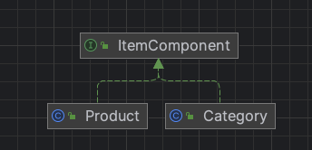

# 컴포지트 패턴
> Composite 패턴은 객체들을 트리 구조로 구성하여 부분-전체 계층을 나타내는 패턴입니다. 이 패턴은 단일 객체와 복합 객체를 동일하게 처리할 수 있도록 합니다.
> Composite 패턴의 핵심 아이디어는 클라이언트가 개별 객체와 복합 객체를 모두 동일하게 취급할 수 있어야 한다는 것입니다. 이는 단일 객체와 복합 객체 모두가 동일한 인터페이스를 구현하도록 하는 것으로 구현됩니다.
> - GoF의 디자인 패턴

- 객체를 트리 구조로 구성해서 부분-전체 계층구조를 구현함
    - 예) 메뉴와 같은 항목을 같은 구조에 넣어 부분 전체 계층(part-whole hierarchy)
        - 부분(메뉴 및 메뉴 항목)들이 계층을 이루고 있지만 모든 부분을 묶어서 전체로 다룰수 있는 구조
- 컴포지트 패턴을 사용하면 클라이언트에서 개별 객체와 복잡 객체를 똑같은 방법으로 다룰 수 있음

## 특징
- 컴포지트 패턴을 사용하면 객체의 구성과 개별 객체를 노드로 가지는 트리 형태의 객체 구조를 만들 수 있음
- 복합 구조(composite structure)를 사용하면 복합 객체와 개별 객체를 대상으로 똑같은 작업을 적용할 수 있음
    - 복합 객체와 개별 객체를 구분할 필요가 거의 없음
- 재귀적인 구조

## 장점
- 클라이언트가 개별객체와 복합객체 동일하게 취급하여 내부구조에 대해 알 필요가 없어서 구조적 유연성 제공
- 클라이언트에서 단순하게 객체 접근이 가능
- 새로운 요소의 추가가 편리하고 범용성 있는 설계가 가능

## 단점
- 복합 객체와 개별 객체를 동일하게 취급해야 해서 인터페이스 공유로 불필요한 메서드가 생길 수 있음
- 설계가 복잡해 질 수 있음

## 활용
- 트리 구조 같은 객체 구조를 구현해야 할 때 사용
- 클라이언트 코드가 개별 객체와 복합 객체 요소를 모두 균일하게 처리하도록 하고 싶을 때 사용

## 예시
- ItemComponent: 아이템 나타내는 인터페이스
- Category: Composite 카테고리 구현 클래스, 상품 추가, 삭제 등의 기능 추가
- Product: Leaf 상품 구현 클래스
- MenuMain: 메뉴 추가 및 보여 주는 클라이언트 클래스

## diagram

