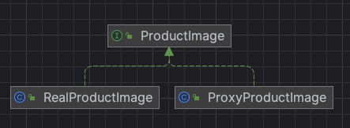

# 프록시 패턴
- 특정 객체로의 접근을 제어하는 대리인(특정 객체를 대변하는 객체)를 제공하는 패턴
- 객체에 대한 접근을 제어하기 위해 대리자를 두는 패턴

## 특징
- 실제 개발에서 자주 사용되는 패턴
- 객체의 사용 방법을 제어하고 보안, 성능, 복잡성 등의 측면에서 유용하게 사용될 수 있음
- 프록시 패턴은 원본 클래스를 변경하지 않은 상태로 프록시 클래스를 도입하여 원본 클래스와 관련 없는 새로운 기능을 추가하는 것
- 프록시 패턴 방식 2가지
    - 인터페이스 기반 구현
    - 상속 기반 구현

### 인터페이스 기반의 프록시 패턴
- 원본 클래스와 동일한 인터페이스를 가지는 클래스와 이를 구현하는 프록시 클래스를 정의
- 원본 클래스는 주요 비즈니스 기능만 담당하고 프록시 클래스가 주요 비즈니스 코드 실행 전후에 성능 통계와 같은 다른 종류의 코드를 추가하는 역할을 함
- 이때 프록시 클래스는 주요 비즈니스 코드를 실행하기 위해서 위임을 통해 원본 클래스를 호출
- 원본 클래스와 프록시 클래스가 동일한 인터페이스를 구현하고, 구현이 아닌 인터페이스를 기반으로 코드를 작성하여 원본 클래스를 프록시 클래스의 객체로 교체하는 데 큰 노력이 필요하지 않음

```java
IUserController userController = new UserControllerProxy(new UserController());
```

### 상속 기반의 프록시 패턴
- 인터페이스 기반 프록시 패턴에서는 원본 클래스와 프록시 클래스가 동일한 인터페이스를 구현
    - 하지만 원본 클래스가 외부 라이브러리의 클래스일 뿐만 아니라 인터페이스를 정의하지 않고 있어서 클래스를 직접 수정할 수 없는 경우에는 인터페이스를 새로 정의할 수 없음
    - 이런 경우 상속을 사용하여 외부 클래스를 확장할 수 있음

```java
public class UserControllerProxy extends UserController {
	private MetricsCollector metricsCollector;

	public UserControllerProxy() {
		this.metricsCollector = new MetricsCollector();
	}

	// 상속 받은 클래스를 오버라이드 해서 작업 후 실제 로직 실행
	public UserVo login(String telephone, String password) {
		long startTimeStamp = System.currentTimeMilles();
		UserVo userVo = super.login(telephone, password); //실제 로직
		long endTimeStamp = System.currentTimeMillis();
		long responseTime = endTimeStamp - startTimeStamp;
		RequestInfo requestInfo = new RequestInfo("login", responseTime, startTimeStamp);
		metricsCollector.recordRequest(requestInfo);
		return userVo;
	}
	...
}

// UserControllerProxy 클래스 사용 예
UserController userController = new UserControllerProxy();
```

### 리플렉션 기반의 동적 프록시
- 위 코드는 문제가 있음
    - 프록시 클래스가 원본 클래스의 모든 메서드를 다시 구현하고 각 메서드에 유사한 코드 논리를 첨부해야 함
    - 기능 추가 클래스가 많은 경우 모두에 대해 프록시 클래스를 생성해야 함
        - 예) 추가 원본 클래스가 50개만 프록시 클래스도 50개 추가 필요
- 위 문제 해결을 위해 동적 프록시 사용 가능
- 동적 프록시 dynamic proxy
    - 각 원본 클래스에 대한 프록시 클래스를 미리 작성하는 대신, 코드를 실행하는 도중에 원본 클래스에 대한 프록시 클래스를 동적으로 생성하고, 코드 내의 원본 클래스를 프록시 클래스로 대체하는 것
- 자바에서 기본적으로 동적 프록시 지원

```java
public class MetricsCollectorProxy {
	private MetricsCollector metricsCollector;

	public MetricsCollectorProxy() {
		this.metricsCollector = new MetricsCollector();
	}

	public Object createProxy(Object proxiedObject) {
		Class<?>[] interface = proxiedObject.getClass().getInterfaces();
		DynamicProxyHandler handler = new DynamicProxyHandler(proxiedObject);
		return Proxy.newProxyInstance(proxiedObject.getClass().getClassLoader(), interfaces, handler);
	}

	private class DynamicProxyHandler implements InvocationHandler {
		private Object proxiedObject;
		public DynamicProxyHandler(Object proxiedObject) {
			this.proxiedObject = proxiedObject;
		}

		@Override
		public Obejct invoke(Object proxy, Method method, Object[] args) throws Throwable {
			long startTimeStamp = System.currentTimeMilles();
			Obejct result = method.invoke(proxiedObject, args);
			long endTimeStamp = System.currentTimeMillis();
			long responseTime = endTimeStamp - startTimeStamp;
			String apiName = proxiedObject.getClass().getName() + ":" + method.getName();
			RequestInfo requestInfo = new RequestInfo(apiName, responseTime, startTimeStamp);
			metricsCollector.recordRequest(requestInfo);
			return userVo;
		}
	}
}

// MetricsCollectorProxy 클래스 사용 예
MetricsCollectorProxy proxy = new MetricsCollectorProxy();
IUserController userController = (IUserController)proxy.createProxy(new UserController());
```

- 실제로 Spring AOP의 기본 구현 원칙은 동적 프록시를 기반으로 함
    - 사용자는 프록시 클래스를 생성할 클래스를 구성하고 원본 클래스의 주요 비즈니스 코드가 실행되기 전과 후에 수행할 추가 기능을 정의
    - 스프링은 이러한 클래스에 동적 프록시 클래스를 생성해주고 원본 클래스의 객체를 JVM의 동적 프록시 클래스 객체로 대체함
    - 코드에서 원본 클래스를 실행해야 하는 메서드는 프록시 클래스를 실행하는 메서드로 대체 됨

## 사용 이유
- 객체 생성에 초기화 비용이 많이 들거나 복잡한 경우 간단한 처리는 대리자를 통해 하게 함
- 실제적으로 비용이 많이 들어가는 처리 일 때 객체를 만들도록 함
- 원격 객체라든가 생성하기 힘든 객체, 보안이 중요한 객체와 같은 다른 객체로의 접근을 제어하는 대리인 객체를 만들 수 있음

## 활용
- 원격지 프록시 (remote proxy) : 서로 다른 주소 공간에 존재하는 객체를 대리하는 로컬 객체
    - 네트워크를 통해 클라이언트 요청을 전달하여 네트워크와의 작업의 모든 복잡한 세부 사항을 처리
- 가상 프록시 (virtual proxy) : 고비용의 객체는 필요한 경우만 생성
    - 무거운 서비스 객체가 항상 가동되지 않도록 필요시 초기화 진행
- 보호용 프록시 (protection proxy) : 실제 객체에 대한 접근 권한을 제어하기 위한 경우 사용
- 로깅 프록시(logging proxy) : 실제 객체에 대한 요청들의 기록을 유지하려는 경우
- 캐싱 프록시(caching proxy) :  클라이언트 요청 결과 캐시 후 반복 요청에 대한 캐싱 구현

## 장점
- 보안 및 접근 제어가 가능함
- 지연 로딩 및 캐싱을 통해 성능 향상 가능
- 서비스 객체가 준비되지 않았거나 사용할 수 없는 경우에도 작동

## 단점
- 새로운 클래스들을 많이 추가해야 함
- 프록시 객체 생성 관리에 추가적인 오버헤드 발생 가능


## 예시
실제 이미지 로딩을 필요할 때에만 생성하여 캐시에 저장하는 예시
- ProductImage: 상품 이미지 인터페이스
- ProxyProductImage: 상품 이미지 캐싱 프록시 클래스
- RealProductImage: 실제 상품 이미지 클래스
- Main: 클라이언트 실행 클래스

### diagram

