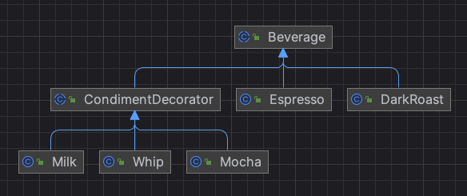

# 데코레이터 패턴 Decorator Pattern
- 원본 클래스에 향상된 기능을 추가하는 것이 목적인 경우 사용하는 패턴
- 객체에 추가 요소를 동적으로 더할 수 있음
  - 장식과 실제 내용물 동일시(Decorator는 원본 클래스와 동일한 상위 클래스를 상속 받고, 구성으로 가짐)

## 특징
- 상속 보다는 기능의 유연한 확장이 가능한 패턴
- 데코레이터의 슈퍼클래스는 자신이 장식하고 있는 객체의 슈퍼클래스와 같음
- 한 객체를 여러 개의 데코레이터로 감쌀 수 있음
- 데코레이터는 자신이 감싸고 있는 객체와 같은 슈퍼클래스를 가지고 있기에 원래 객체(싸여 있는 객체)가 들어갈 자리에 데코레이터 객체를 넣어도 상관 없음
- 데코레이터는 자신이 장식하고 있는 객체에게 어떤 행동을 위임하는 일 말고도 추가 작업을 수행할 수 있음
- 객체에 동적으로 새로운 서비스를 추가할 수 있음

## 장점
- 단순한 상속보다 설계의 융통성 증대
- Decorator의 조합을 통해 새로운 서비스를 지속적으로 추가할 수 있음
  - 부가 요소를 자유자재로 장착/해제 할 수 있음
  - 필요 없는 경우 Decorator 삭제 가능
- 지나치게 복잡한 상속 문제를 해결
    - 상속으로 해결 시 기능 조합에 따른 모든 클래스가 생성될 수 있음

## 단점
- 작은 규모의 객체들이 많이 생성될 수 있음
- 데코레이션이 많은 경우 코드가 복잡해 보임

## 관련 클래스
- 자바의 I/O 스트림 클래스 Decorator 패턴으로 설계
    - 입력 스트림(input stream)
    - 출력 스트림(output stream)

## 예시
- Beverage: 음료 추상 클래스, 필드(사이즈, 설명)와 가격 계산하는 메서드 정의
  - DarkRoast: 다크 로스트 커피 구현 클래스 
  - Espresso: 에스프레소 커피 구현 클래스
- CondimentDecorator: 음료에 추가 가능한 메뉴 추상 클래스, Beverage 상속 받고, 구성으로 가짐
  - Milk: 우유 토핑 구현 클래스, 사이즈에 따라 추가금 계산 로직 구현
  - Mocha: 모카 토핑 구현 클래스, 사이즈에 따라 추가금 계산 로직 구현
  - Whip: 휘핑크림 토핑 구현 클래스, 사이즈에 따라 추가금 계산 로직 구현
- Cafe: 주문을 받아서 음료를 생성하고 토핑을 추가해서 금액을 알려주는 클래스

### diagram

