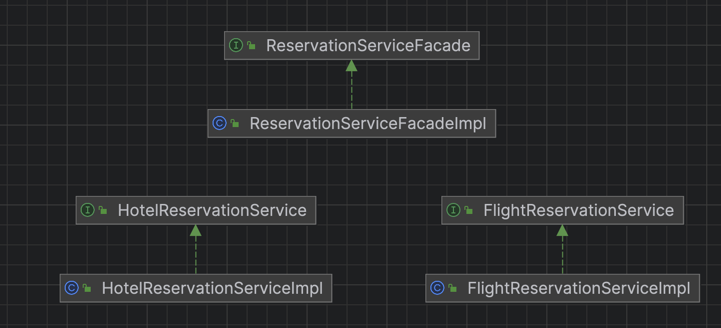

# 퍼사드 패턴
- 서브시스템에 있는 일련의 인터페이스를 통합 인터페이스로 묶어주는 패턴
- 퍼사드는 인터페이스를 단순하게 만들고 클라이언트와 구성 요소로 이루어진 서브시스템을 분리하는 역할도 함

> 퍼사드 패턴은 서브 시스템에 대한 통합 인터페이스 세트를 제공하고, 하위 시스템을 더 쉽게 만들기 위한 상위 통합 인터페이스를 제공한다.
 - GoF의 디자인 패턴

## 특징
- 단순화된 인터페이스로 서브 시스템을 더 편리하게 사용하려고 쓰임
- 복잡한 서브 시스템을 단순한 인터페이스로 감싸서 복잡성 감소

## 장점
- 클라이언트와 서브 시스템이 서로 긴밀하게 연결되지 않아도 됨
- 고수준 인터페이스도 정의하여 서브 시스템을 더 편리하게 사용 가능
- 서브 클래스의 기능을 접근해서 세부 기능 사용도 가능

## 단점
- 애플리케이션의 모든 클래스에 결합된 전지전능한 객체가 될 수 있음

## 퍼사드 vs 어댑터
- 퍼사드와 어댑터 모두 여러 개의 클래스를 감쌀 수 있음
- 퍼사드
    - 인터페이스를 단순하게 만드는 용도
    - 많은 객체의 하위 시스템과 함께 작동
- 어댑터
    - 인터페이스를 다른 인터페이스로 변환하는 용도
    - 일반적으로 하나의 객체만 래핑

## 예시
- 예약서비스 퍼사드 패턴 적용
  - 패키지 예약의 경우 단건 예약이 아닌 호텔과 비행기 예약을 함께 하는 서비스 구현
- ReservationServiceFacade: 예약 서비스 퍼사드 인터페이스, 호텔과 비행기 함께 예약
- ReservationServiceFacadeImpl: 예약 서비스 구현체
- FlightReservationService: 비행기 예약 서비스 인터페이스
- FlightReservationServiceImpl: 비행기 예약 서비스 구현체
- HotelReservationService: 호텔 예약 서비스 인터페이스
- HotelReservationServiceImpl: 호텔 예약 서비스 구현체

### diagram

